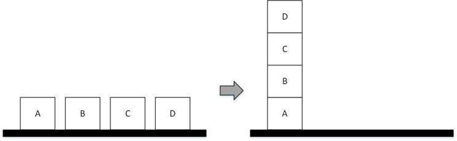

========================
Blocks-world PDDL Python
========================

Getting started
===============

The framework is released as EGG file to be used on a Desktop platform, therefore it can be easily installed in a Python installation.

The framework needs `ANTLR4 <https://www.antlr.org/>`_ library for its operation.

Using EmbASP
============

In the following, we describe an actual usage of the framework by means of a running example;
as a use case, we will develop a simple Desktop application to solve the blocks-world problem.

The complete code of this example is freely available `here <https://www.mat.unical.it/calimeri/projects/embasp/files/EmbASP_Desktop_BlocksWorld_Python.zip>`_.

We will make use of the annotation-guided mapping, in order to retrieve the actions constituting a PDDL plan via Python objects.

To this purpose, the following classes are intended to represent possible actions that a blocks-world solution plan can feature:

.. code-block:: python

  class PickUp(Predicate):
     predicateName="pick-up"
        
     def __init__(self, block=None):
        super(PickUp, self).__init__([("block")])
        self.block = block
            
     [...]

.. code-block:: python

  class PutDown (Predicate):
     predicateName="put-down"
        
     def __init__(self, block=None):
        super(PutDown, self).__init__([("block")])
        self.block = block
            
     [...]

.. code-block:: python

  class Stack (Predicate):
     predicateName="stack"
        
     def __init__(self, block1=None, block2=None):
        super(Stack, self).__init__([("block1"), ("block2")])
        self.block1 = block1
        self.block2 = block2
            
     [...]

.. code-block:: python

  class Unstack (Predicate):
     predicateName="unstack"
        
     def __init__(self, block1=None, block2=None):
        super(Unstack, self).__init__([("block1"), ("block2")])
        self.block1 = block1
        self.block2 = block2
            
     [...]
            

At this point, supposing that we are given two files defining the blocks-world domain and a problem instance, we can start deploying our application:

.. code-block:: python

  handler  = DesktopHandler(SPDDesktopService())
  
  input_domain = PDDLInputProgram(PDDLProgramType.DOMAIN)
  input_domain.add_files_path("../domain.pddl")
  
  input_problem= PDDLInputProgram(PDDLProgramType.PROBLEM)
  input_problem.add_files_path("../p01.pddl")
  
  handler.add_program(input_domain)
  handler.add_program(input_problem)
  
  PDDLMapper.get_instance().register_class(PickUp)
  PDDLMapper.get_instance().register_class(PutDown)
  PDDLMapper.get_instance().register_class(Stack)
  PDDLMapper.get_instance().register_class(Unstack)
  
  output = handler.start_sync()
  
  for obj in output.get_actions_objects():
     if isinstance(obj, PickUp) | isinstance(obj, PutDown) | isinstance(obj, Stack) | isinstance(obj, Unstack) :
        print(obj)

The file contains an |Handler|_ instance as field, that is initialized with a |DesktopHandler|_ using the required parameter |SPDDesktopService|_.

Then it's set-up the input to the solver; since PDDL requires separate definitions for domain and problem, two |PDDLInputProgram|_ are created and then given to the handler.

The next lines inform the |PDDLMapper|_ about what classes are intended to map the output actions.

Finally the solver is invoked, and the output is retrieved.

The output actions can be managed accordingly to the user's desiderata. 

|

For further information, contact `embasp@mat.unical.it <embasp@mat.unical.it>`_ or visit our `website <https://www.mat.unical.it/calimeri/projects/embasp/>`_.

.. |Handler| replace:: ``Handler``
.. |DesktopHandler| replace:: ``DesktopHandler``
.. |SPDDesktopService| replace:: ``SPDDesktopService``
.. |PDDLInputProgram| replace:: ``PDDLInputProgram``
.. |PDDLMapper| replace:: ``PDDLMapper``

.. _Handler: ../_static/doxygen/python/classbase_1_1handler_1_1Handler.html
.. _DesktopHandler: ../_static/doxygen/python/classplatforms_1_1desktop_1_1desktop__handler_1_1DesktopHandler.html
.. _SPDDesktopService: ../_static/doxygen/python/classplatforms_1_1desktop_1_1desktop__service_1_1DesktopService.html
.. _PDDLInputProgram: ../_static/doxygen/python/classlanguages_1_1pddl_1_1pddl__input__program_1_1PDDLInputProgram.html
.. _PDDLMapper: ../_static/doxygen/python/classlanguages_1_1pddl_1_1pddl__mapper_1_1PDDLMapper.html

