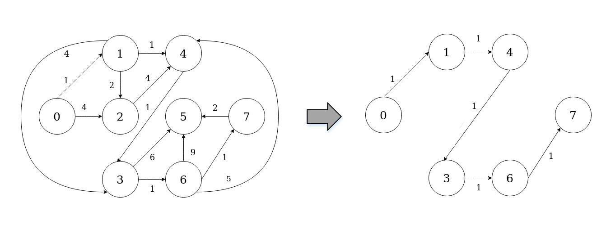

========================
Shortest-path ASP Python
========================

Getting started
===============

The framework is released as EGG file to be used on a Desktop platform, therefore it can be easily installed in a Python installation.

The framework needs `ANTLR4 <https://www.antlr.org/>`_ library for its operation.

Using EmbASP
============

In the following, we describe an actual usage of the framework by means of a running example;
as a use case, we will develop a simple Desktop application to solve the shortest-path problem.

The complete code of this example is freely available `here <https://www.mat.unical.it/calimeri/projects/embasp/files/ShortestPathPython.zip>`_.

We will make use of the annotation-guided mapping, in order to create Python object constituting ASP predicates.

To this purpose, the following classes are intended to represent possible predicates that an ASP program can use:

.. code-block:: python

  class Edge(Predicate):
    predicate_name = "edge"
    
    def __init__(self, source=None, destination=None, weight=None):
      Predicate.__init__(self, [("source"),("destination"),("weight")])
      self.source = source
      self.destination = destination
      self.weight = weight

    [...]

.. code-block:: python

  class Path(Predicate):
    predicate_name = "path"

    def __init__(self, source=None, destination=None, weight=None):
      Predicate.__init__(self, [("source"),("destination"),("weight")])
      self.source = source
      self.destination = destination
      self.weight = weight

    [...]

At this point, supposing that we have embedded the DLV2 solver in this project, we can start deploying our application:

.. code-block:: python
  
  def getEdges():

    edges = []
    
    edges.append(Edge(0,1,1))
    edges.append(Edge(0,2,4))
    edges.append(Edge(1,2,2))
    edges.append(Edge(1,3,4))
    edges.append(Edge(1,4,1))
    edges.append(Edge(2,4,4))
    edges.append(Edge(3,5,6))
    edges.append(Edge(3,6,1))
    edges.append(Edge(4,3,1))
    edges.append(Edge(6,4,5))
    edges.append(Edge(6,5,9))
    edges.append(Edge(6,7,1))
    edges.append(Edge(7,5,2))

    return edges

  try:
    
    handler = DesktopHandler(DLV2DesktopService("../../executable/dlv2"))

    ASPMapper.get_instance().register_class(Edge)
    ASPMapper.get_instance().register_class(Path)

    inputProgram = ASPInputProgram()

    source = 0    # source node
    destination = 7    # destination node
    
    rules = "source(" + str(self.source) + "). destination(" + str(self.destination) + ")."
    rules += "path(X,Y,W) | notPath(X,Y,W) :- source(X), edge(X,Y,W)."
    rules += "path(X,Y,W) | notPath(X,Y,W) :- path(_,X,_), edge(X,Y,W), not to(X)."
    rules += "visited(X) :- path(_,X,_)."
    rules += ":- destination(X), not visited(X)."
    rules += ":~ path(X,Y,W). [W@1 ,X,Y]"

    inputProgram.add_program(rules)
    inputProgram.add_objects_input(self.getEdges())

    handler.add_program(inputProgram)
    
    answerSets = handler.start_sync()

    for answerSet in answerSets.get_optimal_answer_sets():
        path = []     # edges in the shortest path (unsorted)
        sum_ = 0      # total weight of the path
    
        for obj in answerSet.get_atoms():
            if isinstance(obj, Path):
                path.append(obj)
                sum_ += int(obj.get_weight())
    
	sortedPath = []   # edges in the shortest path (sorted)
        join(source, path, sortedPath)   # sorts the edges
        show(sortedPath, sum_)     # shows the path
    
  except Exception as e:
    print(str(e))

The class contains an |Handler|_ instance as field, that is initialized with a |DesktopHandler|_ using the parameter |DLV2DesktopService|_ with a string representing the path to the DLV2 local solver.

The |ASPMapper|_ registers the classes created before in order to manage the input and output objects.

A string and a list of ``Edge`` representing facts, rules and constraints of the ASP program are added to an |ASPInputProgram|_, and the |ASPInputProgram|_ is added to the |Handler|_.

Finally the solver is invoked, and the output is retrieved.

The output predicates can be managed accordingly to the user's desiderata. In this example the ``Path`` predicates, that represent the shortest path, are collected, sorted, and printed as well as the total weight of the path.

|

For further information, contact `embasp@mat.unical.it <embasp@mat.unical.it>`_ or visit our `website <https://www.mat.unical.it/calimeri/projects/embasp/>`_.

.. |Handler| replace:: ``Handler``
.. |DesktopHandler| replace:: ``DesktopHandler``
.. |DLV2DesktopService| replace:: ``DLV2DesktopService``
.. |ASPMapper| replace:: ``ASPMapper``
.. |ASPInputProgram| replace:: ``ASPInputProgram``

.. _Handler: ../_static/doxygen/python/classbase_1_1handler_1_1Handler.html
.. _DesktopHandler: ../_static/doxygen/python/classplatforms_1_1desktop_1_1desktop__handler_1_1DesktopHandler.html
.. _DLV2DesktopService: ../_static/doxygen/python/classspecializations_1_1dlv2_1_1desktop_1_1dlv2__desktop__service_1_1DLV2DesktopService.html
.. _ASPMapper: ../_static/doxygen/python/classlanguages_1_1asp_1_1asp__mapper_1_1ASPMapper.html
.. _ASPInputProgram: ../_static/doxygen/python/classlanguages_1_1asp_1_1asp__input__program_1_1ASPInputProgram.html

